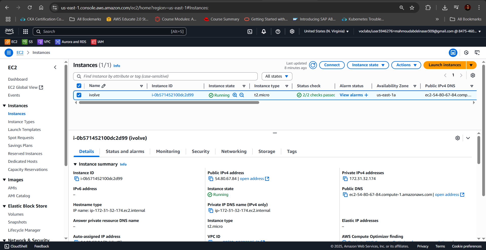
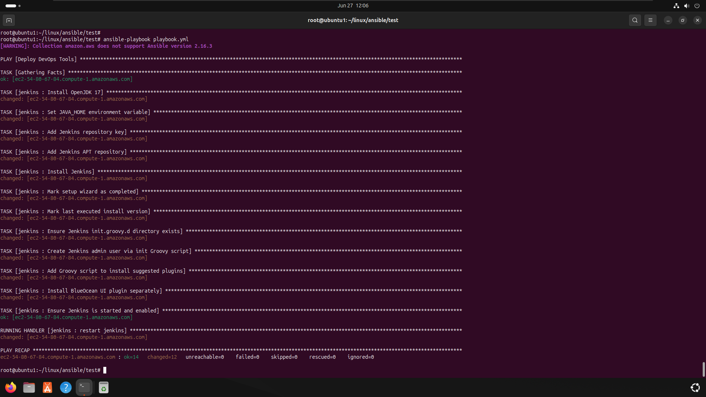
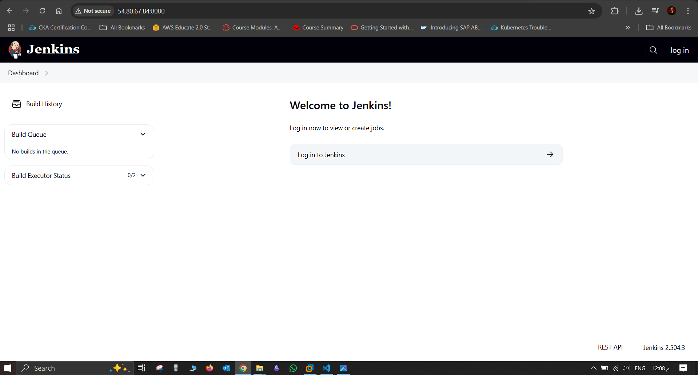

# Jenkins Ansible Role - Automated Setup with Suggested Plugins and BlueOcean UI on AWS

## Overview

This Ansible role automates the installation and setup of Jenkins on an Ubuntu-based EC2 instance. It includes:

- Installation of Java 17 (required for Jenkins)
- Jenkins installation from the official repository
- Disabling the setup wizard
- Creating an admin user via Groovy script
- Automatic installation of all suggested Jenkins plugins (including BlueOcean)
- Ensuring Jenkins is enabled and running

---

## Requirements

- Ubuntu-based EC2 instance 
- Internet connectivity to access Jenkins repositories and plugin updates
- Ansible (v2.16.x or later)
- IAM credentials properly configured via `aws configure`

---

## Files Structure

```
├── ansible.cfg
├── aws_ec2.yml
├── ec2key.pem
├── playbook.yml
├── roles/
    └── jenkins/
        └── tasks/
            └── main.yml               # Main role logic
        └── handlers/
            └── main.yml               # Service restart handlers
        └── templates/
        └── files/
        └── vars/
            └── main.yml              # Default vars (e.g. jenkins_user, jenkins_password)
        └── defaults/
```

---

## Included Plugins

This role installs **Jenkins suggested plugins**, including the BlueOcean UI.

---

## How It Works

1. Installs Java 17 using `apt`.
2. Adds Jenkins APT repo and key.
3. Installs Jenkins.
4. Skips the setup wizard using marker files.
5. Creates admin user with Groovy script (`basic-security.groovy`).
6. Installs all required plugins via `plugins.groovy`.
7. Installs BlueOcean UI explicitly via `blueocean.groovy`.
8. Restarts Jenkins after setup.

---

## Variables (in `jenkins/vars/main.yml`)

```yaml
jenkins_user: admin
jenkins_password: admin123
jenkins_email: admin@example.com
jenkins_fullname: Admin
```

---

## Usage

```bash
ansible-playbook -i aws_ec2.yml playbook.yml
```

Make sure your EC2 instance:

- Has the tag `Name=ivolve`
- Has Python installed
- Allows SSH access via the provided key
---

## Notes

- Plugin installation happens on the first run only
- Groovy scripts are placed under `/var/lib/jenkins/init.groovy.d/`
- Jenkins must have time to sync with the update center

---




## Author

Prepared by Mahmoud – Jenkins Setup using Ansible Roles\
[LinkedIn Profile](https://www.linkedin.com/in/mahmoud-998877b)

