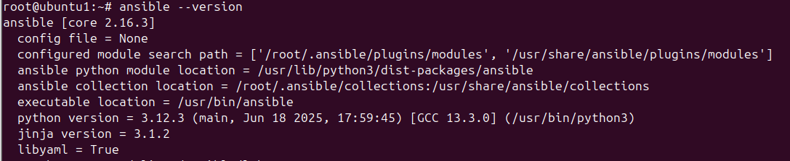
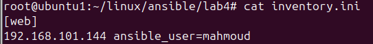
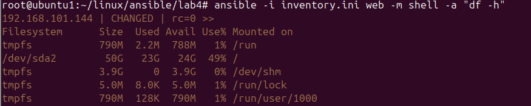

##  Lab 4: Ansible Installation

###  Objective

Set up Ansible on a control node and configure SSH access to the managed node.

### Steps

1. **Install Ansible** on the control node:
   ```bash
   sudo apt update
   sudo apt install -y ansible
   ```

2. **Create inventory file**


3. **Generate SSH key**

4. **Copy public key to managed node**
```bash
ssh-copy-id mahmoud@192.168.101.144
```
5. **Test with ad-hoc command**


