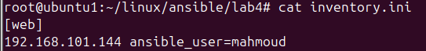

#  Lab 5: Ansible Playbook for Web Server Configuration

##  Objective

Automate the deployment of a web server using Ansible by:
- Installing **Nginx**
- Deploying a custom web page
- Verifying the web server is working on the managed node

```
lab5/
├── inventory.ini
├── playbook.yml
└── files/
└── index.html
```

#### 1. inventory


#### 2. index.html

#### 3. playbook.yml
```bash
---
- name: Configure Web Server
  hosts: web
  become: yes

  tasks:
    - name: Install Nginx
      apt:
        name: nginx
        state: present
        update_cache: yes

    - name: Deploy custom index.html
      copy:
        src: files/index.html
        dest: /var/www/html/index.html
        owner: www-data
        group: www-data
        mode: '0644'

    - name: Ensure Nginx is running
      service:
        name: nginx
        state: started
        enabled: yes

```

#### 4. run playbook


#### 5. check webpage

