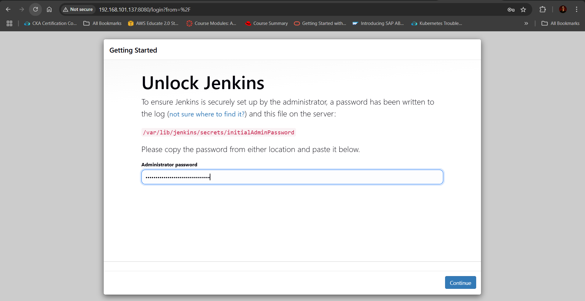

# Lab 6 – Application Deployment Using Ansible Roles

## 🎯 Objective

Automate the installation of essential DevOps tools on a remote Ubuntu server using Ansible roles:
- Docker 🐳
- kubectl ☸️
- Jenkins 🔧

The goal is to practice modular Ansible playbooks using **roles**, with each tool installed and configured through its dedicated role.

---

## 📁 Project Structure


lab6/
├── inventory.ini
├── playbook.yml
└── roles/
├── docker/
│ └── tasks/main.yml
├── kubectl/
│ └── tasks/main.yml
└── jenkins/
└── tasks/main.yml

#### 1. Create Roles
```bash
ansible-galaxy init roles/docker
ansible-galaxy init roles/kubectl
ansible-galaxy init roles/jenkins
```
#### 2. Define Role Tasks
roles/docker/tasks/main.yml
```bash
---
- name: Ensure Java 17 is installed 
  apt:
    name: openjdk-17-jdk
    state: present
    update_cache: yes

- name: Add Jenkins GPG key
  apt_key:
    url: https://pkg.jenkins.io/debian-stable/jenkins.io-2023.key
    state: present

- name: Add Jenkins apt repository
  apt_repository:
    repo: "deb https://pkg.jenkins.io/debian-stable binary/"
    state: present
    filename: jenkins

- name: Update apt cache
  apt:
    update_cache: yes

- name: Install Jenkins
  apt:
    name: jenkins
    state: present

- name: Enable and start Jenkins
  systemd:
    name: jenkins
    enabled: true
    state: started

- name: Wait for Jenkins to generate admin password
  wait_for:
    path: /var/lib/jenkins/secrets/initialAdminPassword
    timeout: 120

- name: Show Jenkins initial admin password
  command: cat /var/lib/jenkins/secrets/initialAdminPassword
  register: jenkins_password
  changed_when: false

- name: Print Jenkins admin password
  debug:
    msg: "Jenkins Admin Password: {{ jenkins_password.stdout }}"
```

roles/jenkins/handlers/main.yml
```bash
---
- name: Reload systemd
  command: systemctl daemon-reexec

- name: Restart Jenkins
  systemd:
    name: jenkins
    state: restarted
```

#### 3. Create Playbook site.yml
```bash
---
- name: Deploy DevOps Tools
  hosts: all
  become: true
  roles:
    - docker
    - kubectl
    - jenkins
```
#### 4. Create Inventory File
```bash
[web]
192.168.101.137
```
#### 5. Run the Playbook
```bash
ansible-playbook -i inventory playbook.yml
```


#### Verification



