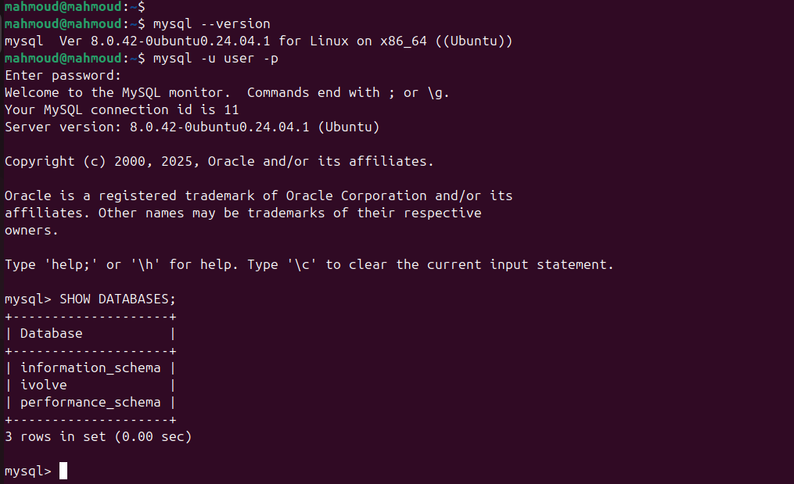
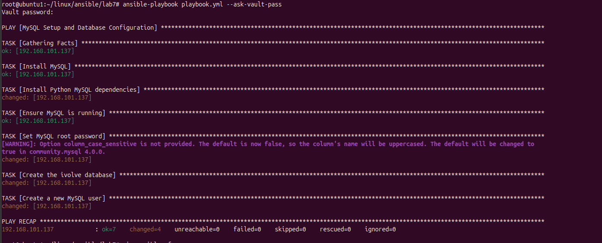

# Lab 7: Write an Ansible playbook to install MySQL, create ivovle database, create user with all privileges on ivolve DB. Use Ansible Vault to encrypt sensitive information such as database user password, and incorporate the encrypted data into an Ansible playbook.
## Overview
### This lab focuses on using Ansible to:
1- Install MySQL.
2- Create a database (ivolve).
3- Create a user with all privileges on the database.
4- Secure sensitive information (e.g., passwords) using Ansible Vault.
5- This ensures secure automation of database setup with reusable configurations.
## Step-by-Step Guide
### Step 1 : Prepare the Environment
#### 1- Install Ansible Vault (included with Ansible by default).
#### 2- Set Up Inventory File:
```bash
[web]
192.168.101.137
```
### Step 2 : Create the Vault-Encrypted File
#### 1- Create a Vault File for Sensitive Data :
```
ansible-vault create secrets.yml
```
#### 2- Add Encrypted Variables: 
```
db_root_password: "secure_root_password"
db_user: "user"
db_user_password: "secure_user_password"
```
#### 3- Save and Encrypt the File. 
- Ansible Vault will encrypt secrets.yml.
### Step 3 :  Write the Ansible Playbook
#### 1- Create a YAML Playbook File (playbook.yml):
```
---
- name: MySQL Setup and Database Configuration
  hosts: web
  become: true
  collections:
    - community.mysql
  vars_files:
    - secrets.yml

  tasks:
    - name: Install MySQL
      apt:
        name: mysql-server
        state: present
        update_cache: yes

    - name: Install Python MySQL dependencies
      apt:
        name: python3-pymysql
        state: present

    - name: Ensure MySQL is running
      service:
        name: mysql
        state: started
        enabled: true

    - name: Set MySQL root password
      community.mysql.mysql_user:
        name: root
        host: localhost
        password: "{{ db_root_password }}"
        login_unix_socket: /var/run/mysqld/mysqld.sock

    - name: Create the ivolve database
      community.mysql.mysql_db:
        name: ivolve
        state: present
        login_user: root
        login_password: "{{ db_root_password }}"

    - name: Create a new MySQL user
      community.mysql.mysql_user:
        name: "{{ db_user }}"
        password: "{{ db_user_password }}"
        priv: "ivolve.*:ALL"
        host: "%"
        state: present
        login_user: root
        login_password: "{{ db_root_password }}"
```
### Step 4 : Test the Playbook
#### 1- Run the playbook in check mode :
```
ansible-playbook playbook.yml --check --ask-vault-pass
```
#### 2- Provide the Vault password when prompted.
### Step 5 : Execute the Playbook
#### Run the playbook to apply the changes:
```
ansible-playbook playbook.yml --ask-vault-pass
```
### Step 6 :  Validate the Configuration
#### 1- Log in to the MySQL database on the target server
```
mysql -u user -p
```




