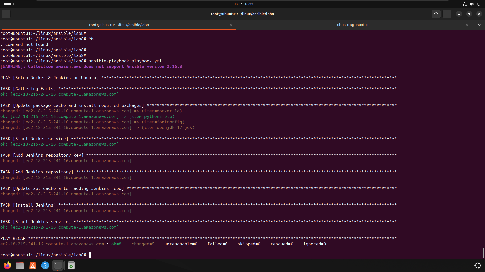
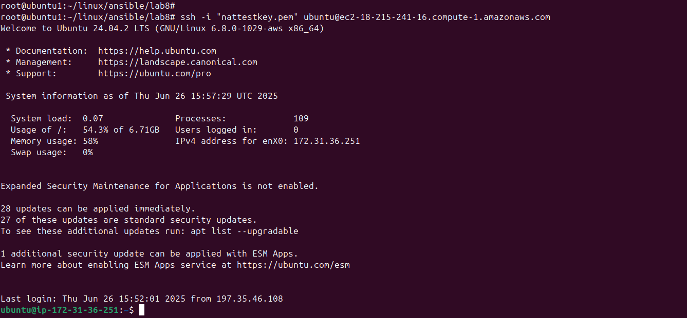

#  Ansible Dynamic Inventory with AWS EC2 

This lab demonstrates how to configure Ansible to dynamically discover and manage AWS EC2 instances using the `aws_ec2` plugin, and automatically provision them with Docker and Jenkins.

---

### Project Structure
├── ansible.cfg
├── aws_ec2.yml
├── playbook.yml
├── nattestkey.pem
└── README.md

###  Lab Objectives

- Create EC2 instance with tag `Name=ivolve`
- Use Ansible's dynamic inventory to auto-discover EC2
- Provision EC2 with Docker & Jenkins
- Use `ansible-playbook` to run automation

---

###  Prerequisites
- AWS account with EC2 access 
- Temporary AWS credentials (Access Key, Secret Key)
- `EC2` instance running **Ubuntu**, with `tag: Name=ivolve`
- `.pem` SSH key to connect to EC2
- SSH access from local machine to EC2
- Ensure Python is installed on the EC2
---
###  Tools Used
- Ansible
- boto3
- AWS CLI
- Ubuntu EC2 instance
- Jenkins (latest)
- Docker
---

###  Setup Steps

#### 1.  Configure AWS Credentials
Set temporary credentials :
```bash
aws configure
```
#### 2. Create EC2 with Tag
```bash
Key: Name
Value: ivolve
```
#### 3. Install Required Tools on Local Machine
```bash
sudo apt update
sudo apt install -y awscli python3-pip
pip3 install boto3 botocore
ansible-galaxy collection install amazon.aws --force
```
#### 4. Setup Ansible Configuration ansible.cfg

#### 5. Setup Dynamic Inventory aws_ec2.yml

#### 6. Verify Inventory
```bash
ansible-inventory --graph
```


#### 7. Create the Ansible Playbook playbook.yml

#### 8. Run the Playbook


#### 9. ssh ec2


#### 10. access jenkins from internet


### Author Mahmoud Abdelnaser Elsayed
