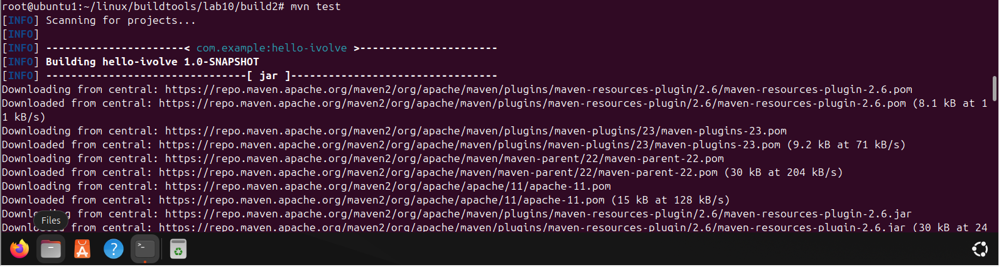
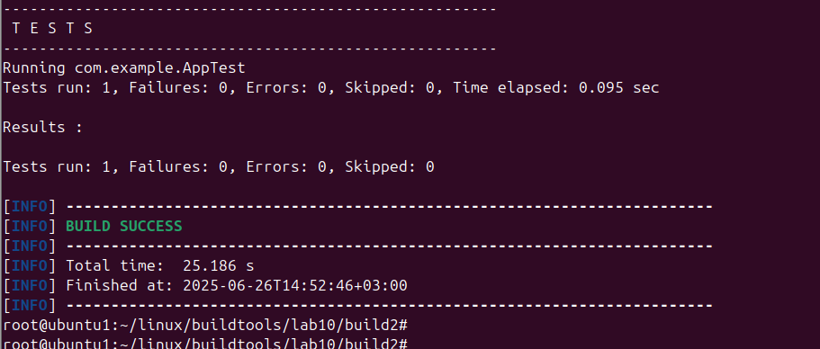
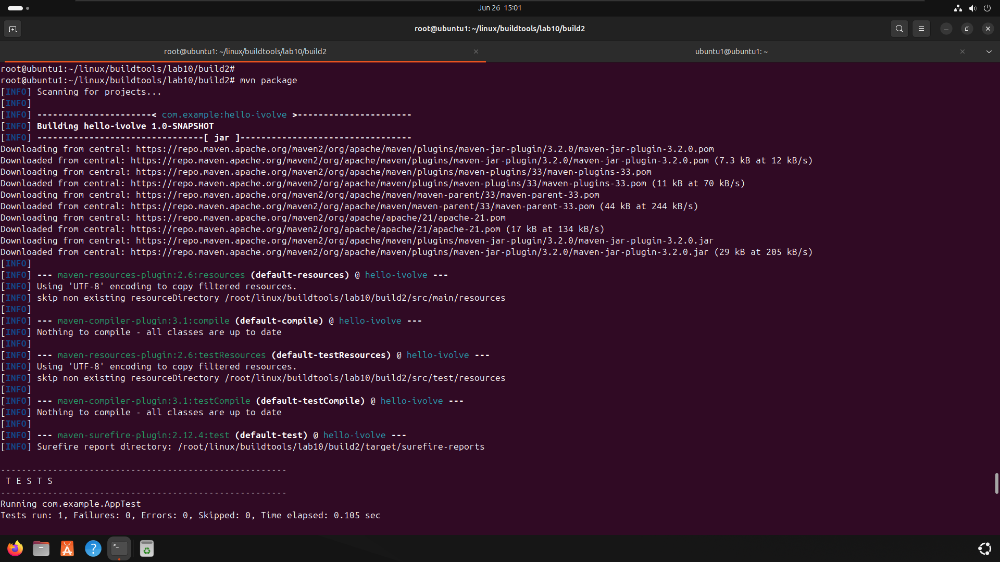
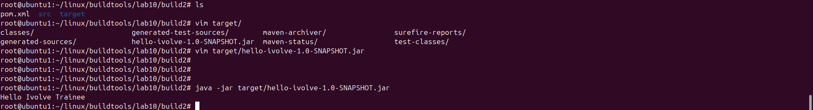

# Lab 10: Build Java App using Maven

This lab demonstrates how to build and test a simple Java application using **Apache Maven**.

## 📁 Project Structure
```
build2/
├── pom.xml
├── src/
│ ├── main/java/com/ivolve/App.java
│ └── test/java/com/ivolve/AppTest.java
```
---
## 🧰 Requirements
- Java (OpenJDK 21 or compatible)
- Apache Maven
- Git
---

## 🚀 Steps to Run the Lab

### 1. Clone the Repository

```bash
git clone https://github.com/Ibrahim-Adel15/build2.git
cd build2
```
### 2. Install Maven 
```
sudo apt update
sudo apt install maven -y
mvn -v
```
### 3. Run Unit Tests
```
mvn test
```


### 4. Build the Application
```
mvn package
```

### 5. Run the Application
```
java -jar target/hello-ivolve-1.0-SNAPSHOT.jar
```

