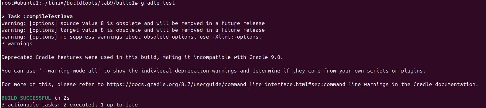
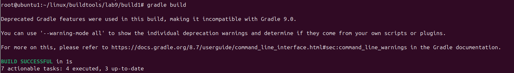

# Lab 9: Build Java App using Gradle

This lab demonstrates how to build and test a simple Java application using **Gradle**.

## 📁 Project Structure

```
build1/
├── build.gradle
├── settings.gradle
├── src/
│ ├── main/java/com/ivolve/App.java
│ └── test/java/com/ivolve/AppTest.java

```
---
## 🧰 Requirements

- Java (OpenJDK 21 or compatible)
- Gradle 8.x (or newer)
- Git (to clone repo)

---
## 🚀 Steps to Run the Lab
### 1. Clone the Repository

```bash
git clone https://github.com/mahmoudAbdelnaser99/build1.git
cd build1
```
### 2. Install Gradle
```bash
curl -s "https://get.sdkman.io" | bash
source "$HOME/.sdkman/bin/sdkman-init.sh"
sdk install gradle
gradle -v
```

### 3. Run Unit Tests
```bash
gradle test
```

### 4. Build the Application
```bash
gradle build
```

### 5. Run the Application
```bash
java -jar build/libs/ivolve-app.jar
```


