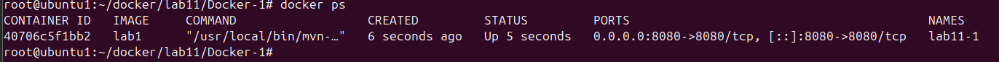
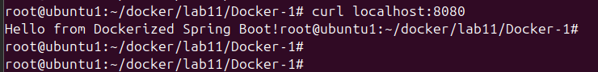
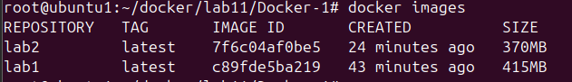
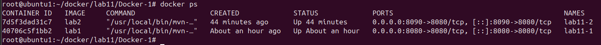
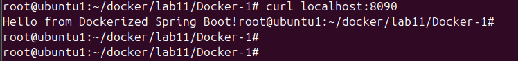

# Lab 11: Run Java Spring Boot App in a Container

This lab demonstrates two approaches to containerizing a Java Spring Boot application using Docker.

## 📌 Objective
- Learn how to containerize a Spring Boot app.
- Compare building the app **inside** the Docker container vs **outside** on the local machine.
---
## 📦 Project Structure
```
Docker-1/
├── src/
├── target/
├── pom.xml
└── Dockerfile
```
---

## 🔧 Method 1: Build App Inside Docker 

### ✅ Steps:

1. Clone the project:
```bash
git clone https://github.com/Ibrahim-Adel15/Docker-1.git
cd Docker-1
```
2. Create this Dockerfile
```bash
FROM maven:3.9.10-eclipse-temurin-17-alpine
WORKDIR /app
COPY . .
RUN mvn package
CMD ["java" , "-jar", "target/demo-0.0.1-SNAPSHOT.jar"]
EXPOSE 8080
```
3. Build the Docker image
```
docker build -t lab1 .
```
4. Run the container
```
docker run -d -p 8080:8080 --name lab11-1 lab1
```

5. Test the app
```
curl http://localhost:8080
```


## 🔧 Method 2: Build App Locally, Then Dockerize

### ✅ Steps:

1. install java 17 and Build the app locally
```bash
sudo apt update
sudo apt install openjdk-17-jdk
sudo update-alternatives --config java    # Set JDK 17 as default
mvn package
```
2. Create Dockerfile
```bash
FROM maven:3.9.10-eclipse-temurin-17-alpine

WORKDIR /app

COPY target/demo-0.0.1-SNAPSHOT.jar app.jar

CMD ["java", "-jar", "app.jar"]

EXPOSE 8080
```

3. Build the Docker image
```
docker build -t lab2 .
```

4. Run the container
```
docker run -d -p 8090:8080 --name lab11-2 lab2
```

5. Test the app
```
curl http://localhost:8090
```



