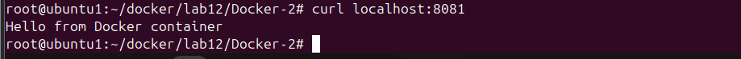

# Lab 12: Multi-Stage Docker Build for Node.js App (Alpine Optimized)

This lab demonstrates how to containerize a Node.js application using:
- Multi-stage Docker build (optimized)
- Alpine Linux for minimal image size

---
## 📁 Project Structure
```
Docker-2/
├── app.js
├── package.json
├── Dockerfile1 # Single-stage build
├── Dockerfile2 # Multi-stage optimized build
```
---
## 🔧 Steps 
1. Clone the Repository
```bash
git clone https://github.com/Ibrahim-Adel15/Docker-2.git
cd Docker-2
```
2. Multi-Stage Optimized Build Dockerfile
```bash
FROM node:20-alpine AS build
WORKDIR /app
COPY package.json ./
RUN npm install --only=production
COPY . .

FROM alpine:3.20
RUN apk add --no-cache nodejs
WORKDIR /app
COPY --from=build /app ./
EXPOSE 8080
CMD ["node", "app.js"]
```
3. ✅ Build & Run
```
docker build -t multi-stag -f Dockerfile
docker run -d -p 8081:8080 --name multi-cont multi-stag
```


4. test 



