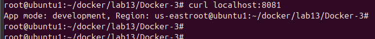

# Lab 13: Docker Environment Variables (Python + Flask)

This lab demonstrates 3 different methods to pass environment variables into a Docker container using a simple Flask application.

---
## 📁 Project Structure
```
Docker-3/
├── app.py
├── Dockerfile
├── .env
```
## 📦 Clone the Application

```bash
git clone https://github.com/Ibrahim-Adel15/Docker-3.git
cd Docker-3
```
---

## Method1 and Mehod2
### 🐳 Dockerfile1 , Dockerfile2

```bash
ROM python:3.14.0b3-alpine3.22
WORKDIR /app
COPY . .
RUN pip install flask
CMD ["python", "app.py"]
EXPOSE 8080
```
2. build image 
```
docker build -t flask1 -f Dockerfile1 .
```
3. Run Docker Container
```
docker run -d -p 8081:8080 --name flask1 -e APP_MODE=development -e APP_REGION=us-east flask1
```
4. test app
```
curl localhost:8081
```

## Method2 ENV in seperate file 
1. creat .env file
```bash
APP_MODE=staging
APP_REGION=us-west
```
2. Run Docker Container
```
docker run -d -p 8082:8080 --name flask2 --env-file .env flask1
```
3. test app


## Method3 which put ENV in Dockerfile

### 🐳 Dockerfile3

```bash
FROM python:3.14.0b3-alpine3.22
ENV APP_MODE=production
ENV APP_REGION=canada-west
WORKDIR /app
COPY . .
RUN pip install flask
CMD ["python", "app.py"]
EXPOSE 8080
```
2. build image 
```
docker build -t flask3 -f Dockerfile3 .
```
3. Run Docker Container
```
docker run -d -p 8083:8080 --name flask3 flask3
```
4. test app
```
curl localhost:8083
```


