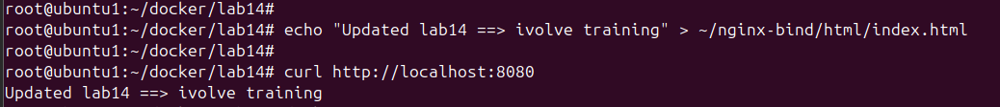

# Lab: Docker Volume and Bind Mount with Nginx

## 🧪 Objective
Use Docker volumes and bind mounts to:
- Persist Nginx logs.
- Serve custom HTML content from the host.
- Verify logs and dynamic page updates.

---

## 🔧 Steps
### 1. Create Docker Volume for Logs
```bash
docker volume create nginx_logs
```
### 2. Create Bind Mount Directory on Host
```
mkdir -p ~/nginx-bind/html
```
### 3. Create a Custom index.html
```
echo "Hello from Bind Mount" > ~/nginx-bind/html/index.html
```
### 4. Run Nginx Container with Volume and Bind Mount
```
docker run -d --name my-nginx -v nginx_logs:/var/log/nginx -v ~/nginx-bind/html:/usr/share/nginx/html -p 8080:80 nginx
```
    Volume: /var/log/nginx (logs)
    Bind Mount: /usr/share/nginx/html (custom content)
    Port: 8080 exposed

### 5. Verify Nginx Page from Local Machine
```
curl http://localhost:8080
```

### 6. Modify HTML Content and Test Again
```
echo "Updated lab14 ==> ivolve training" > ~/nginx-bind/html/index.html
```



### 7. Clean Up
```
docker stop my-nginx
docker rm my-nginx
docker volume rm nginx_logs
```