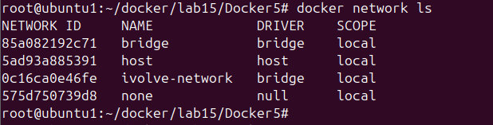
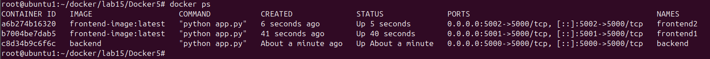
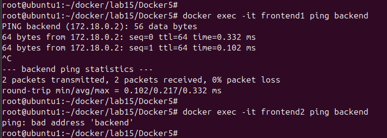

# Lab 15: Custom Docker Network for Microservices

This lab demonstrates how to create a simple microservices architecture using Docker, Python (Flask), and a custom Docker network.

---

## 🧾 Lab Objectives

- Create Dockerfiles for frontend and backend apps.
- Build images for each.
- Connect containers using a custom Docker bridge network.
- Test communication between containers.
- Understand the difference between default and custom networks.

---
## 🧬 Project Structure

```bash
Docker5/
├── backend/
│   └── app.py
├── frontend/
│   ├── app.py
│   └── requirements.txt
```
## 📦 Step 1: Clone the Repository
```
git clone https://github.com/Ibrahim-Adel15/Docker5.git
cd Docker5
```
## 🛠️ Step 2: Dockerfile for Frontend frontend/Dockerfile
```bash
FROM python:3.14.0b3-alpine3.22
WORKDIR /app
COPY requirements.txt .
RUN pip install -r requirements.txt
COPY . .
CMD ["python", "app.py"]
EXPOSE 5000
```
### Build Frontend Image
```
cd frontend
docker build -t frontend-image .
```

## 🛠️ Step 3: Dockerfile for Backend backend/Dockerfile
```bash
FROM python:3.14.0b3-alpine3.22
WORKDIR /app
RUN pip install flask
COPY . .
CMD ["python", "app.py"]
EXPOSE 5000
```
### Build Frontend Image
```
cd backend
docker build -t backend .
```
## 🌐 Step 4: Create Custom Docker Network
```
docker network create ivolve-network
```


## 🚀 Step 5: Run Containers
```bash
docker run -d -p 5000:5000 --name backend --network ivolve-network backend
docker run -d -p 5001:5000 --name frontend1 --network ivolve-network frontend-image:latest
ocker run -d -p 5002:5000 --name frontend2  frontend-image:latest
```

## 🔍 Step 6: Verify Communication



## 🧼 Step 7: Clean Up
```
docker rm -f $(docker ps -aq)
docker rmi -f $(docker images -aq)
```


