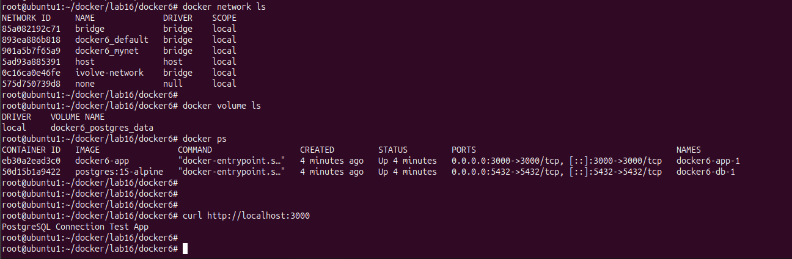

# 🚀 Node.js + PostgreSQL App with Docker Compose

This project demonstrates how to containerize a Node.js application with a PostgreSQL database using Docker Compose.

## 📁 Project Structure
```
├── docker-compose.yml
├── Dockerfile
├── package.json
└── src
    ├── app.js
    └── db.js
```
---
## 📦 Setup
## 1. Clone the repository
```bash
git clone https://github.com/Ibrahim-Adel15/docker6.git
cd docker6
```
## 2.  🐳 create docker compose  docker-compose.yml
```bash
version: '3.8'

services:
  app:
    build: .
    ports:
      - "3000:3000"
    depends_on:
      - db

  db:
    image: postgres:15-alpine
    ports:
      - "5432:5432"
    environment:
      POSTGRES_USER: ${POSTGRES_USER}
      POSTGRES_PASSWORD: ${POSTGRES_PASSWORD}
      POSTGRES_DB: ${POSTGRES_DB}
    volumes:
      - postgres_data:/var/lib/postgresql/data
    networks:
      - mynet

volumes:
  postgres_data:
networks:
  mynet:
```

## 3. Environment Variables .env
```
POSTGRES_USER=postgres
POSTGRES_PASSWORD=postgres
POSTGRES_DB=postgres
```
## 4. Build and Run the containers
```
docker-compose up --build
```
## 5. access Application on port 3000




