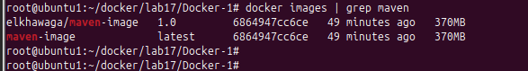
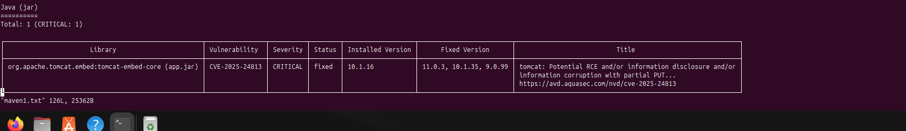
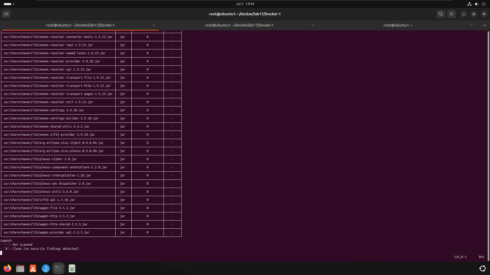

# 🔒 Lab 17: Scan Docker Image with Trivy

This lab demonstrates how to build a Java application Docker image, scan it for vulnerabilities using **Trivy**, and push the image to **Docker Hub**.

---
## 📋 Objectives
- Install Trivy
- Clone a Maven-based Java application
- Write a Dockerfile to package the app
- Build a Docker image
- Scan the image using Trivy and save a report in JSON format
- Push the scanned image to Docker Hub
---
## 🔧 Prerequisites
- Docker installed: [Install Docker](https://docs.docker.com/get-docker/)
- Docker Hub account
- Trivy installed: [Trivy Installation Guide](https://trivy.dev/latest/getting-started/installation/)
---

## 📦 Step-by-Step Instructions

## 1️⃣ Clone the Application Code

```bash
git clone https://github.com/Ibrahim-Adel15/Docker-1.git
cd Docker-1
```

## 2. install java 17 and Build the app locally
```bash
sudo apt update
sudo apt install openjdk-17-jdk
sudo update-alternatives --config java    # Set JDK 17 as default
mvn package
```
## 3. Create Dockerfile
```bash
FROM maven:3.9.10-eclipse-temurin-17-alpine
WORKDIR /app
COPY target/demo-0.0.1-SNAPSHOT.jar app.jar
CMD ["java", "-jar", "app.jar"]
EXPOSE 8080
```

## 3. Build the Docker image
```
docker build -t maven-image .
```

## 4.  Scan the Image with Trivy
```
trivy image maven-image > maven.txt
or
trivy image maven-image --format json --output trivy-report.json
```
This generates a vulnerability report in trivy-report.json.

## 5. Critical Tomcat Vulnerability (CVE-2025-24813)
```
trivy image --severity CRITICAL maven-image > maven1.txt
```


## 6. Fix Critical Tomcat Vulnerability (CVE-2025-24813)
By default, Spring Boot 3.2.0 uses a vulnerable version of Tomcat (10.1.16), which triggers a critical Trivy alert.
To fix this:
Open your pom.xml and add this dependency to override the Tomcat version:
```
<dependency>
    <groupId>org.apache.tomcat.embed</groupId>
    <artifactId>tomcat-embed-core</artifactId>
    <version>10.1.35</version> <!-- ✅ Patched version -->
</dependency>
```
### Build the Docker Image again and scan with trivy ==> no Vulnerabilities
```
mvn clean package
docker build -t maven-image .
trivy image --severity CRITICAL maven-image > maven5.txt
```


## 7. Log in to Docker Hub, Tag and push image
```
docker login
docker tag maven-image elkhawaga/maven-image:1.0
docker push elkhawaga/maven-image:1.0 
```


