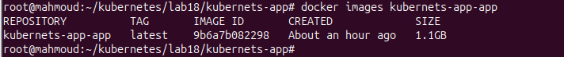
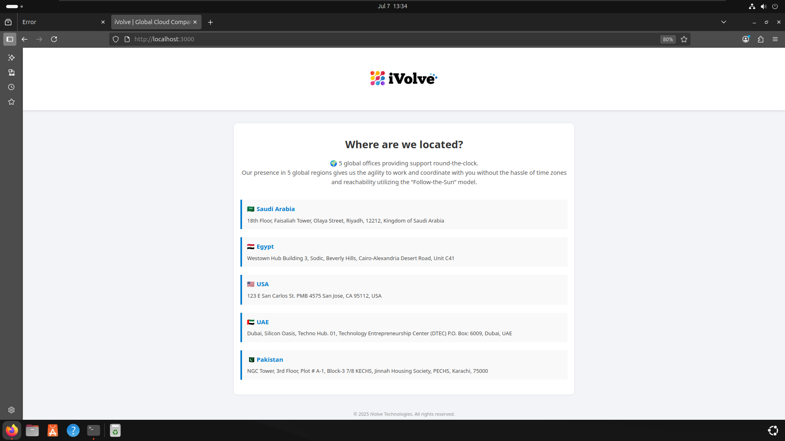
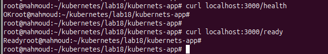
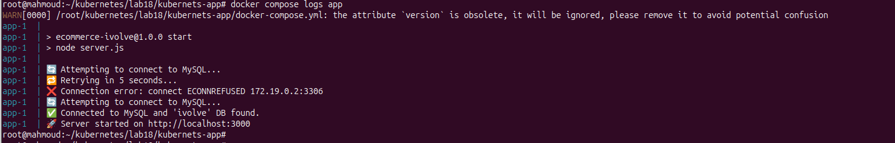

# 🐳 Lab 18: Containerized Node.js + MySQL App with Docker Compose

This project demonstrates how to containerize a full-stack application consisting of a Node.js backend and a MySQL database using Docker Compose.

---

## 📁 Project Structure

```
├── db.js
├── docker-compose.yml
├── Dockerfile
├── frontend
│   ├── assets
│   │   └── ivolve-logo.png
│   └── index.html
├── package.json
└── server.js

```


---

## 📦 Requirements

- Docker
- Docker Compose
- Git
---

## 🚀 Getting Started

## 1. Clone the repository

```bash
git clone git clone https://github.com/mahmoudAbdelnaser99/kubernets-app.git
cd kubernetes-app
```
## 2. Create .env file
```
DB_HOST=db
DB_USER=root
DB_PASSWORD=root
MYSQL_ROOT_PASSWORD=root
MYSQL_DATABASE=ivolve
```
## 3. Docker Compose Up
```
docker compose up --build
```


## 🧪 Health Checks
```
curl http://localhost:3000/health   # ➜ OK
curl http://localhost:3000/ready    # ➜ Ready
```



## 📂 Logs
Application logs are saved inside the logs/access.log file in the container.

## View logs
```
docker compose logs app
```


## 🛰 Push to DockerHub 
```
docker tag kubernetes-app_app elkhawaga/kubernetes-app:latest
docker push elkhawaga/kubernetes-app:latest
```


