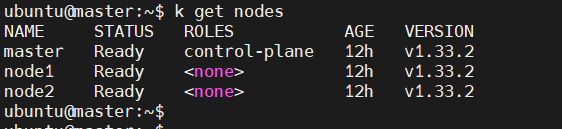
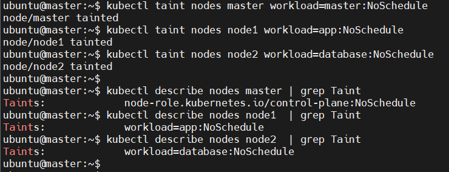
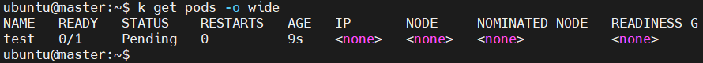
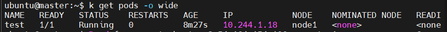

# 🧪 Lab 19: Node Isolation Using Taints in Kubernetes

This lab demonstrates how to isolate workloads in a Kubernetes cluster by applying taints to nodes. Taints allow you to control which pods can be scheduled on specific nodes.

---

## 🎯 Objectives

- Run a Kubernetes cluster with 3 nodes.
- Apply **taints** on each node with a specific key-value pair and `NoSchedule` effect:
  - First node: `workload=master`
  - Second node: `workload=app`
  - Third node: `workload=database`
- Verify the taints are correctly applied using `kubectl describe`.

---

## 🏗️ Lab Setup

Kubernetes cluster is up and running (via kubeadm or minikube) with the following node names:

- `master`
- `node1`
- `node2`
---


## 🛠️ Step 1: Apply Taints & Step 2: Verify Taints

### Taint the master node (optional, usually default):



## Step 3: Test Pod Scheduling

```
kubectl run test --image=nginx
```
Expected: Pod is in Pending state because no nodes accept it due to taints.



## Step 4: Allow Pod on Tainted Node
```bash
apiVersion: v1
kind: Pod
metadata:
  name: test
spec:
  containers:
  - name: nginx
    image: nginx
  tolerations:
  - key: "workload"
    operator: "Equal"
    value: "app"
    effect: "NoSchedule"
```
### apply pod
```
kubectl apply -f app-pod.yaml
```
