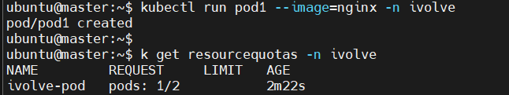

# 🚀 Lab 20: Namespace Management and Resource Quota Enforcement

This lab demonstrates how to:
- Create a custom Kubernetes namespace
- Enforce a ResourceQuota to limit the number of pods
---

## 📁 Lab Objectives

- ✅ Create a namespace called `ivolve`
- ✅ Apply a `ResourceQuota` to limit the number of running pods in that namespace to **2 only**

---

## ⚙️ Step-by-Step Instructions

### 1. Create the Namespace

Apply the following YAML file:

```yaml
apiVersion: v1
kind: Namespace
metadata:
  name: ivolve
```
## apply Namespace
```
kubectl apply -f namespace.yaml
```
## 2. Create a ResourceQuota
```
apiVersion: v1
kind: ResourceQuota
metadata:
  name: ivolve-pod
  namespace: ivolve
spec:
  hard:
    pods: "2"
```
## apply ResourceQuota
```
kubectl apply -f quota.yaml
```

## Check the ResourceQuota
```
kubectl get resourcequota -n ivolve
kubectl describe resourcequota pod-limit -n ivolve
```
## Try to Launch  Pods

