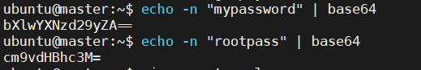
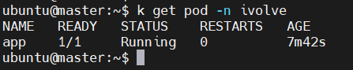

# 🔐 Lab 21: Managing Configuration and Sensitive Data with ConfigMaps and Secrets

This lab demonstrates how to:
- Use **ConfigMaps** to store non-sensitive configuration variables.
- Use **Secrets** to store sensitive data such as passwords.
- Apply both to a namespace and reference them inside a Pod.

---

## 🎯 Lab Objectives

- ✅ Define a **ConfigMap** for MySQL settings:
  - `DB_HOST`: Hostname of the MySQL StatefulSet service.
  - `DB_USER`: Username to connect to the MySQL `ivolve` database.
- ✅ Define a **Secret** for MySQL credentials:
  - `DB_PASSWORD`: Password for `DB_USER`.
  - `MYSQL_ROOT_PASSWORD`: Root password for the MySQL instance.
- ✅ Use **base64** encoding for Secret data values.

---

## 🧱 Prerequisites

- Kubernetes cluster running (e.g., kubeadm).
- Namespace `ivolve` already created.

---

## 🧾 Step 1: Create ConfigMap

Create a file named `configmap.yaml`:

```yaml
apiVersion: v1
kind: ConfigMap
metadata:
  name: mysql-config
  namespace: ivolve
data:
  DB_HOST: mysql
  DB_USER: ivolveuser
```
## apply ConfigMap
```
kubectl apply -f configmap.yaml
```
## 🔐 Step 2: Create Secret
### First, encode the values using base64:


### Create a file secret.yaml:
```
apiVersion: v1
kind: Secret
metadata:
  name: mysql-secret
  namespace: ivolve
type: Opaque
data:
  DB_PASSWORD: bXlwYXNzd29yZA==
  MYSQL_ROOT_PASSWORD: cm9vdHBhc3M=
```
## apply secret
```
kubectl apply -f secret.yaml
```
## Step 3: Test with a Pod
```bash
apiVersion: v1
kind: Pod
metadata:
  name: app
  namespace: ivolve
spec:
  containers:
  - name: nginx
    image: nginx
    env:
    - name: DB_HOST
      valueFrom:
        configMapKeyRef:
          name: mysql-config
          key: DB_HOST
    - name: DB_USER
      valueFrom:
        configMapKeyRef:
          name: mysql-config
          key: DB_USER
    - name: DB_PASSWORD
      valueFrom:
        secretKeyRef:
          name: mysql-secret
          key: DB_PASSWORD
    - name: MYSQL_ROOT_PASSWORD
      valueFrom:
        secretKeyRef:
          name: mysql-secret
          key: MYSQL_ROOT_PASSWORD
```
