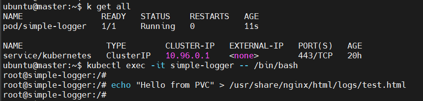
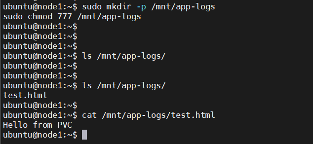

# 📦 Lab 22: Persistent Storage Setup for Application Logging

This lab demonstrates how to create and use persistent storage in Kubernetes for logging purposes using a PersistentVolume (PV) and PersistentVolumeClaim (PVC) with `hostPath`.

---

## 🎯 Objectives

- Create a **PersistentVolume (PV)** with:
  - Size: `1Gi`
  - Storage type: `hostPath`
  - Path: `/mnt/app-logs` (must exist on node with 777 permission)
  - Access Mode: `ReadWriteMany`
  - Reclaim Policy: `Retain`

- Create a **PersistentVolumeClaim (PVC)** to:
  - Request `1Gi` storage
  - Use access mode `ReadWriteMany`

---

## 🧱 Setup

### 1. Prepare the Host Path on the Target Node

Before applying the PV, ensure the target node has the log directory:

### Run this command on the node1 where the pod will be scheduled
```bash
sudo mkdir -p /mnt/app-logs
sudo chmod 777 /mnt/app-logs
```
### 2. Define the Persistent Volume pv.yaml
```bash
apiVersion: v1
kind: PersistentVolume
metadata:
  name: app-logs-pv
spec:
  capacity:
    storage: 1Gi
  accessModes:
    - ReadWriteMany
  hostPath:
    path: /mnt/app-logs
  persistentVolumeReclaimPolicy: Retain
```
### 3. Define the Persistent Volume Claim
```bash
apiVersion: v1
kind: PersistentVolumeClaim
metadata:
  name: app-logs-pvc
spec:
  accessModes:
    - ReadWriteMany
  resources:
    requests:
      storage: 1Gi
```
### 4. Apply PV and PVC
```
kubectl apply -f pv.yaml
kubectl apply -f pvc.yaml
```
### Verify
```
kubectl get pv
kubectl get pvc
```
## 🧪 Test: Pod Writing Logs to the PVC pod4.yaml
```bash
apiVersion: v1
kind: Pod
metadata:
  name: simple-logger
spec:
  nodeName: node1  # Schedule pod to the node with /mnt/app-logs
  containers:
  - name: nginx
    image: nginx
    volumeMounts:
    - name: log-volume
      mountPath: /usr/share/nginx/html/logs
  volumes:
  - name: log-volume
    persistentVolumeClaim:
      claimName: app-logs-pvc
```

### run the pod
```
kubectl apply -f pod4.yaml
```


### after add data to pv check from node1



