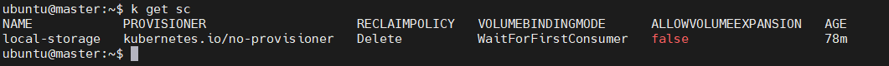
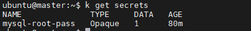
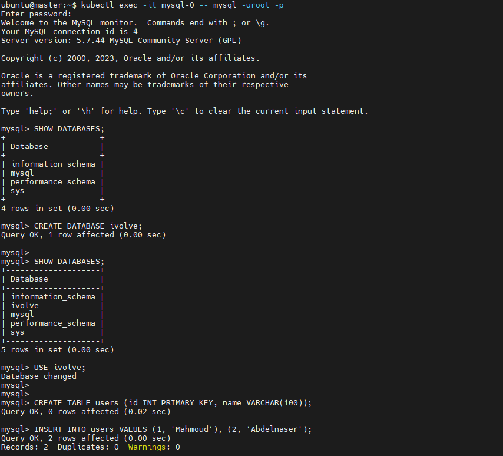
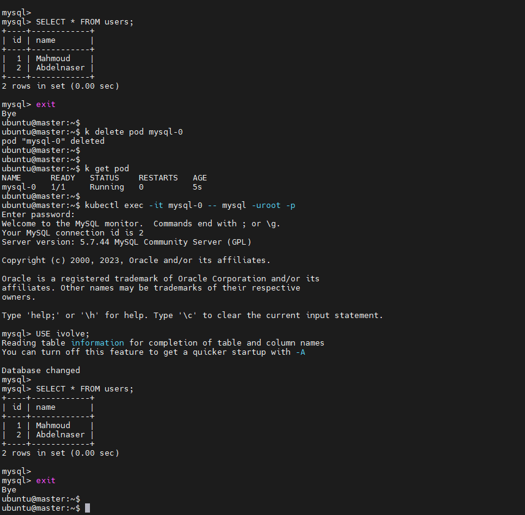

# 🐬 Kubernetes MySQL StatefulSet Lab (Local Storage + Headless Service)

This project demonstrates deploying a **MySQL StatefulSet** on a Kubernetes cluster using:
- A manually created `PersistentVolume` (PV) using `hostPath`
- A `PersistentVolumeClaim` (PVC) with a custom `StorageClass`
- A `Headless Service` for stable DNS resolution
- `nodeSelector` to pin pods to specific nodes with attached storage

---

## ✅ Requirements

- Kubernetes cluster (created via `kubeadm`)
- At least 1 worker node (e.g. `node1`) with:
  - `/mnt/data/mysql` directory
  - Proper permissions set for MySQL container

---

## ⚙️ Setup Steps

### 1. Create a Local StorageClass
```bash
apiVersion: storage.k8s.io/v1
kind: StorageClass
metadata:
  name: local-storage
provisioner: kubernetes.io/no-provisioner
volumeBindingMode: WaitForFirstConsumer
```

## 2. Prepare /mnt/data/mysql on target node1
```
sudo mkdir -p /mnt/data/mysql
sudo chmod 777 /mnt/data/mysql
```
## 3. kubectl apply -f mysql-pv.yaml
```bash
apiVersion: v1
kind: PersistentVolume
metadata:
  name: mysql-pv
spec:
  capacity:
    storage: 1Gi
  accessModes:
    - ReadWriteOnce
  storageClassName: local-storage
  hostPath:
    path: /mnt/data/mysql
  persistentVolumeReclaimPolicy: Retain
  nodeAffinity:
    required:
      nodeSelectorTerms:
      - matchExpressions:
        - key: kubernetes.io/hostname
          operator: In
          values:
          - node1
```
```
kubectl apply -f mysql-pv.yaml
```

## 4. Create Secret for MySQL root password
```
kubectl create secret generic mysql-root-pass --from-literal=password=root
```

## 5. kubectl apply -f mysql-statefulset.yaml
```bash
apiVersion: apps/v1
kind: StatefulSet
metadata:
  name: mysql
spec:
  serviceName: "mysql"
  replicas: 1
  selector:
    matchLabels:
      app: mysql
  template:
    metadata:
      labels:
        app: mysql
    spec:
      nodeSelector:
        kubernetes.io/hostname: node1
      containers:
      - name: mysql
        image: mysql:5.7
        ports:
        - containerPort: 3306
          name: mysql
        env:
        - name: MYSQL_ROOT_PASSWORD
          valueFrom:
            secretKeyRef:
              name: mysql-root-pass
              key: password
        volumeMounts:
        - name: mysql-persistent-storage
          mountPath: /var/lib/mysql
      tolerations:
      - key: "workload"
        operator: "Equal"
        value: "database"
        effect: "NoSchedule"
  volumeClaimTemplates:
  - metadata:
      name: mysql-persistent-storage
    spec:
      accessModes: ["ReadWriteOnce"]
      resources:
        requests:
          storage: 1Gi
      storageClassName: local-storage
```
```
kubectl apply -f mysql-statefulset.yaml
```

## 6. Create Headless Service
```bash
apiVersion: v1
kind: Service
metadata:
  name: mysql
spec:
  clusterIP: None
  selector:
    app: mysql
  ports:
  - port: 3306
    targetPort: 3306
```
```
kubectl apply -f mysql-headless-svc.yaml
```
## 🔍 Test MySQL Pod
```
kubectl exec -it mysql-0 -- mysql -uroot -p
```
🔁 Persistence Test
1. Delete pod:
```
kubectl delete pod mysql-0
```
2. Wait for it to restart, then check if your data still exists:
```
USE ivolve;
SELECT * FROM users;
```




